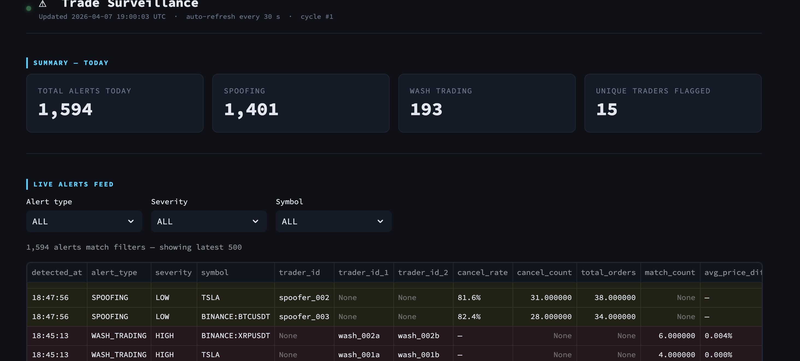
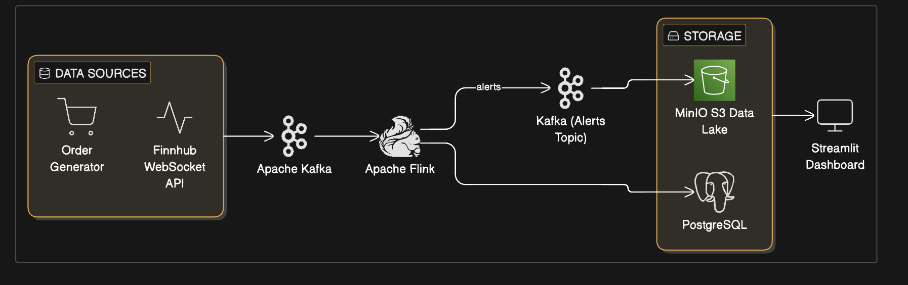

# Real-Time Trade Surveillance Pipeline

A streaming data platform that detects market manipulation (spoofing and wash trading) in real time using live market data from Finnhub, Apache Kafka, Apache Flink, and a medallion-architecture data lake.

Built as a full end-to-end system: from WebSocket ingestion through real-time pattern detection to a compliance analyst dashboard.

**[Read the full writeup on Medium →](https://medium.com/p/69983e4a407b)**




---

## What This Does

Financial regulators require firms to monitor trading activity for market abuse. Most smaller firms still run surveillance as overnight batch jobs, which means suspicious activity is only reviewed the next morning. This platform catches it as it happens.

**Spoofing detection**: Identifies traders who flood the order book with large orders and cancel them within seconds to manipulate prices. Uses sliding window aggregation in Flink with configurable thresholds for cancel count and cancel rate.

**Wash trading detection**: Finds coordinated pairs of accounts trading the same asset back and forth at matching prices and quantities. Uses a stream self-join in Flink with pair normalization to catch both orderings of the same trader pair.

**Results**: All 3 simulated spoofers caught with 80-84% cancel rates. Both wash trading pairs detected with price deviations as low as 0.005%. Zero false positives from 20 normal traders.

---

## Architecture



| Component | Technology | Role |
|-----------|-----------|------|
| Market data ingestion | Finnhub WebSocket API | Real-time stock and crypto prices |
| Event streaming | Apache Kafka | Partitioned topics with symbol-key ordering |
| Order simulation | Python | 27 synthetic traders with configurable behavior profiles |
| Pattern detection | Apache Flink (PyFlink) | Sliding window aggregation and stream self-joins |
| Data lake | MinIO (S3-compatible) + Parquet | Medallion architecture: bronze, silver, gold |
| Alert storage | PostgreSQL | Persistent alert records for compliance |
| Dashboard | Streamlit | Live alert feed, trader risk rankings, asset monitoring |
| Orchestration | Docker Compose | All services in isolated containers |

---

## Quick Start

```bash
# Clone and configure
git clone https://github.com/AtharvaGitProfile/Realtime-trades-surveillance-pipeline.git
cd Realtime-trades-surveillance-pipeline
cp .env.example .env
# Add your Finnhub API key to .env (free at https://finnhub.io)

# Start everything
docker-compose up -d

# Verify services
docker-compose ps

# Check live market data flowing
docker-compose logs -f market-data-collector

# Check alerts being generated
docker exec kafka kafka-console-consumer \
  --bootstrap-server localhost:9092 \
  --topic alerts --from-beginning --max-messages 5

# Open the compliance dashboard
open http://localhost:8501

# Open the Flink dashboard
open http://localhost:8081
```

---

## Project Structure

```
├── docker-compose.yml
├── .env.example
├── services/
│   ├── market-data-collector/     # Finnhub WebSocket → Kafka
│   │   ├── collector.py
│   │   ├── Dockerfile
│   │   └── requirements.txt
│   ├── order-generator/           # Synthetic traders → Kafka
│   │   ├── generator.py
│   │   ├── traders.py
│   │   ├── Dockerfile
│   │   └── requirements.txt
│   ├── flink-processor/           # Real-time detection
│   │   └── jobs/
│   │       ├── spoofing_detector.py
│   │       └── wash_trade_detector.py
│   ├── lakehouse-writer/          # Kafka → MinIO (bronze/silver/gold)
│   │   ├── bronze_writer.py
│   │   ├── silver_gold_writer.py
│   │   ├── Dockerfile
│   │   └── requirements.txt
│   └── dashboard/                 # Streamlit compliance UI
│       ├── app.py
│       ├── Dockerfile
│       └── requirements.txt
├── infrastructure/
│   └── init.sql                   # PostgreSQL schema
├── config/
└── docs/
    └── aws-architecture.md        # Production deployment guide
```

---

## For Engineers: Technical Deep Dive

### Why Kafka key design matters

Every message uses the stock symbol as the Kafka key. This guarantees all events for the same symbol land in the same partition, preserving event ordering. Without this, Flink's windowed aggregations would produce incorrect counts because a cancellation could arrive before the order it cancels.

The producer uses `acks=all` with `retries=3`. In a surveillance context, a lost message could mean a missed manipulation event. Completeness over speed.

### Spoofing detection: sliding window aggregation

The detector uses Flink's HOP table-valued function with a 2-minute window sliding every 30 seconds. Within each window, it computes per-trader, per-symbol cancellation counts and rates.

```sql
SELECT trader_id, symbol,
       SUM(CASE WHEN status = 'CANCELLED' THEN 1 ELSE 0 END) AS cancel_count,
       COUNT(*) AS total_orders,
       cancel_count / total_orders AS cancel_rate
FROM TABLE(
    HOP(TABLE orders, DESCRIPTOR(event_time),
        INTERVAL '30' SECOND, INTERVAL '2' MINUTE)
)
GROUP BY trader_id, symbol, window_start, window_end
HAVING cancel_count > 10 AND cancel_rate > 0.8
```

Why sliding instead of tumbling: a tumbling window would miss spoofing bursts that straddle window boundaries. With 30-second slides, every event falls into multiple overlapping windows.

Why group by symbol: a trader actively trading AAPL while aggressively cancelling BTC orders should only trigger alerts for BTC. Per-symbol grouping keeps detection precise.

### Wash trading detection: stream self-join with pair normalization

The detector joins the orders stream against itself within a 30-second time window, matching on:
- Same symbol
- Opposite sides (buy vs sell)
- Price within 0.5%
- Quantity within 10%
- Different trader IDs
- Both filled (wash traders want execution, not cancellation)

A single match is ignored. The outer aggregation counts matches per trader pair over a 5-minute window and alerts when a pair matches 3+ times.

Pair normalization ensures (A,B) and (B,A) fold into the same group:

```sql
CASE WHEN a.trader_id <= b.trader_id
     THEN a.trader_id ELSE b.trader_id END AS trader_1
```

Without this, match counts split across two groups and might never hit the threshold.

### Event time vs processing time

All Flink jobs use event time with 5-second watermarks. During backlog recovery, processing timestamps cluster together while event timestamps reflect when trades actually occurred. Using processing time would make every backlog look like a spoofing burst.

### Data lake: medallion architecture

**Bronze**: Raw JSON from all Kafka topics, partitioned by `date/hour`. Permanent archive for regulatory compliance. Kafka default retention is 7 days; the lake keeps everything.

**Silver**: Cleaned Parquet. Timestamps normalized to UTC, prices cast to decimal, status values standardized, duplicates removed. Parquet because compliance analysts query specific columns and columnar storage avoids full-row scans.

**Gold**: Pre-computed aggregations. `trader_daily_activity` (cancel rates, order volumes), `asset_hourly_summary` (volatility, spread), `alert_summary` (counts by type and severity). These power the dashboard.

### Trader simulation model

27 traders with distinct behavioral profiles:

| Type | Count | Cancel probability | Orders/min | Avg size | Cancel speed |
|------|-------|--------------------|-----------|----------|-------------|
| Normal | 20 | 10-35% | 0.2-2.0 | 50-500 | 10-120s |
| Spoofer | 3 | 85-95% | 8-15 | 2,000-10,000 | 1-3s |
| Wash trader | 4 (2 pairs) | 5% | 1-3 | 200-1,000 | N/A |

Wash trader pairs share a `partner_id`, trade the same symbol, and use nearly identical order sizes (`order_size_variance: 0.05`) to simulate coordinated activity.

The hybrid data approach uses real prices from Finnhub with synthetic orders placed at/near market price. Detection algorithms are tested against actual market conditions rather than idealized data.

---

## AWS Production Architecture

In production, the local Docker services would map to managed AWS equivalents:

| Local | AWS | Why |
|-------|-----|-----|
| Kafka (Docker) | Amazon MSK | Managed brokers, automatic replication, no patching |
| Flink (Docker) | Amazon Managed Flink | Managed cluster, auto-scaling, checkpointing |
| MinIO | S3  | Modern Data Platform, Unity Catalog |
| PostgreSQL | RDS PostgreSQL | Automated backups, failover, free tier eligible |
| Streamlit (Docker) | ECS Fargate | Serverless containers, no instance management |

Estimated monthly cost: ~$1,065 baseline. Detailed breakdown, IAM policies, VPC layout, and deployment sequence in [docs/aws-architecture.md](docs/aws-architecture.md).

---

## What I Would Add Next

- ML-based anomaly scoring to replace fixed thresholds, trained on the gold layer feature set
- Dead letter queue for malformed events that Flink cannot parse
- Grafana monitoring for pipeline health (lag, throughput, error rates)
- Databricks Delta table format for ACID transactions and time-travel queries on the data lake

---

## Built With

Python, Apache Kafka, Apache Flink (PyFlink), Databricks, PostgreSQL, Streamlit, Docker Compose, Finnhub API

--

## Linkedin

https://www.linkedin.com/in/patilatharva/
